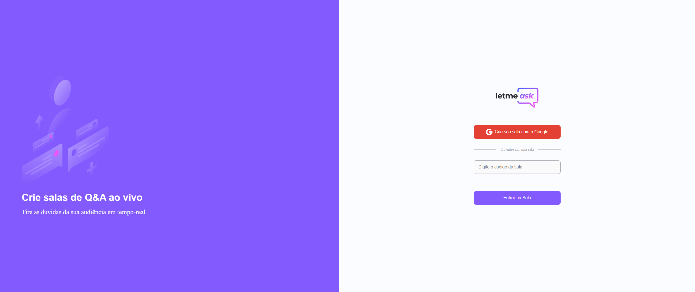

<p align="center" style="background: #fff">
  
</p>

<h1 align="center">
🚧 Letmeask - Em Construção 🚧
</h1>

<p align="center">
  

  

  <a href="https://github.com/Douglasproglima/letmeask-proglima/commits/main">
    
  </a>

  <a href="https://github.com/Douglasproglima/FindHouses/issues">
    
  </a>

  
</p>

<p align="center">
  <a href="#-projeto">Projeto</a>&nbsp;&nbsp;&nbsp;|&nbsp;&nbsp;&nbsp;
    <a href="#rocket-requisitos">Requisitos</a>&nbsp;&nbsp;&nbsp;|&nbsp;&nbsp;&nbsp;
  <a href="#rocket-tecnologias">Tecnologias</a>&nbsp;&nbsp;&nbsp;|&nbsp;&nbsp;&nbsp;
  <a href="#rocket-aprendizado">Aprendizado</a>&nbsp;&nbsp;&nbsp;|&nbsp;&nbsp;&nbsp;
  <a href="#rocket-comandos">Comandos</a>&nbsp;&nbsp;&nbsp;|&nbsp;&nbsp;&nbsp;
  <a href="#rocket-layout">Layout</a>&nbsp;&nbsp;&nbsp;|&nbsp;&nbsp;&nbsp;
  <a href="#memo-licença">Licença</a>
</p>
<br>

## 💻 Projeto
---
Esse projeto foi desenvolvido com o objetivo de atualizar me com reactjs.

## ❗ Requisitos
---
- Você precisa instalar [Node.js](https://nodejs.org/en/download/) e [Yarn](https://yarnpkg.com/) para executar este projeto.
## ✈️ Tecnologias
---
Esse projeto foi desenvolvido com as seguintes tecnologias:

- [Reactjs](https://pt-br.reactjs.org/)
- [Typescript](https://www.typescriptlang.org/)
- [sass](https://sass-lang.com/)
- [Firebase Authentication](https://firebase.google.com/products/auth)
- [Firebase Realtime Database](https://firebase.google.com/products/realtime-database)

\* Para mais detalhes, veja o **[Package.json](./package.json)**

## 🎓 Aprendizados
---
- Reactjs + Firebase Authentication and Realtime Database
- React Hooks
- Typescript

## 📃 Comandos
---

```bash
$ git clone https://github.com/douglasproglima/letmeask-proglima.git && cd letmeask-proglima
$ yarn

# Rename the file .env_example for .env and inform your credentials firebase

$ yarn start
```
The app will be available for access on your browser at http://localhost:3000

## 📐 Regras de Negócio
---
### Roles ENG
 - [x] Only authenticated users can read data from rooms and questions;
 - [x] Only authenticated users can create new rooms;
 - [x] Only authenticated users can send new questions;
 - [x] Only authenticated users can like a question;
 - [x] User can remove a question like if he is the owner;
 - [x] Users can't update or delete questions if not room owners;
 - [x] Only the room owner can update questiona highlight abd answered data;
 - [x] Only the room owner can close the room;
 - [ ] Don't allow duplicated likes from the same author;
 - [ ] Don't allow user to like own questions;
 
### Regras PT-BR
 - [x] Apenas usuários autenticados podem ler dados de salas e perguntas;
 - [x] Apenas usuários autenticados podem criar novas salas;
 - [x] Somente usuários autenticados podem enviar novas perguntas;
 - [x] Apenas usuários autenticados podem gostar de uma pergunta;
 - [x] O usuário pode remover uma pergunta como se ele fosse o proprietário;
 - [x] Os usuários não podem atualizar ou excluir perguntas se não forem os proprietários da sala;
 - [x] Apenas o proprietário da sala pode atualizar as perguntas, realçar e dados respondidos;
 - [x] Apenas o proprietário da sala pode fechar a sala;
 - [] Não permitir curtidas duplicadas do mesmo autor;
 - [] Não permita que o usuário goste de suas próprias perguntas;
## 🎨 Layout
---
### Figma
- [Layout Web](https://www.figma.com/file/kQFDoPWWvyaDKyFFlUYMpe/Letmeask) 

## ⭕ Web
---


Feito com ❤️ por Douglas Lima </h2> [Entre em contato!](https://www.linkedin.com/in/douglasproglima)